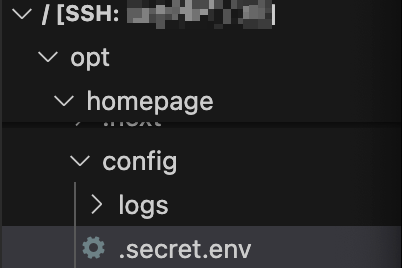
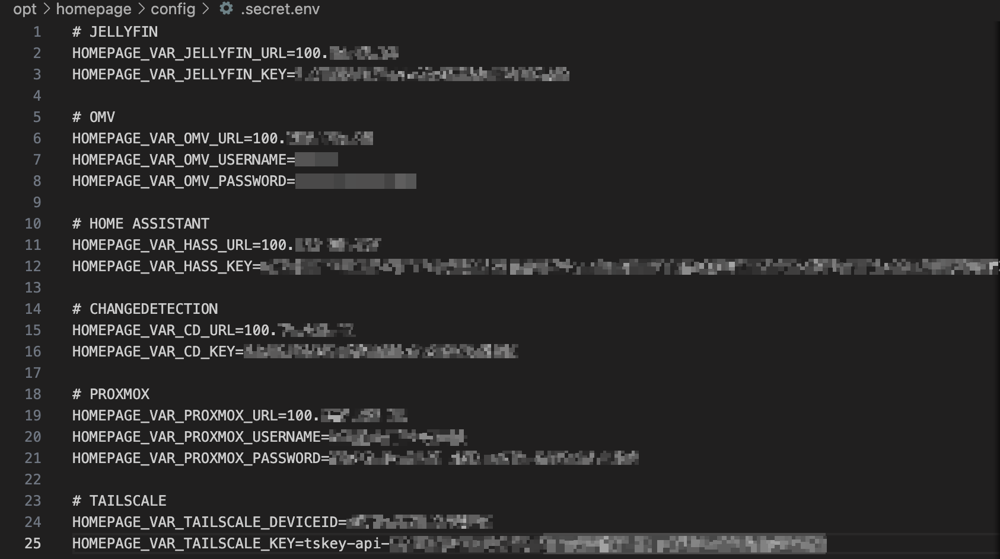

# :clipboard: Homelab Dashboard - Homepage Configuration


Welcome to the repository for my **Homepage** configuration! This project hosts the configuration files for my homelab dashboard, which consolidates access to various services in one convenient place.

## :white_check_mark: Services Included

The current configuration includes the following services:

- **[Jellyfin](https://jellyfin.org/):** Media server for managing and streaming media.
- **[OpenMediaVault](https://www.openmediavault.org/):** NAS management and file sharing.
- **[Home Assistant](https://www.home-assistant.io/):** Home automation platform.
- **[ChangeDetection](https://github.com/dgtlmoon/changedetection.io):** Website change monitoring tool.
- **[Proxmox](https://www.proxmox.com/):** Virtualization and container platform.
- **[Tailscale](https://tailscale.com/):** Mesh VPN for secure remote access.

01/04/2025 [UPDATE] : I added the following part concerning the storage of credentials, URLs and API keys inside a different file. That way, you can easily share your services.yaml file and store all the sensitive information into a dedicated and separate file. This tutorial is specific to the Proxmox approach. If you installed Homepage thanks to Docker, the environment variable creation is different, and well documented on the internet. Nevertheless, it was not so easy to find with the Proxmox approach.

### :soon: Upcoming Additions

I plan to add configurations for the following services in the future:

- **Proxmox Backup Server:** Backup solution for Proxmox.
- **AdGuard Home:** Network-wide ad and tracker blocking.

## How to use, and store your credentials on a separate file, with Homepage on an LXC container (Proxmox)

1. Clone the repository:
   ```bash
   git clone https://github.com/clemcoste/homepage.git

2. Connect with SSH to your Homepage LXC container

3. Upload and replace the files

4. Create a ".secret.env" file in /opt/homepage/config/.secret.env

   Go to the Homepage LXC's shell and execute 
   ```bash
   touch /opt/homepage/config/.secret.env
   nano /opt/homepage/config/.secret.env



5. Add the different environment variables you need



6. Link the file in the homepage.service file, in the [Service] section

Path:
   ```bash
   etc/systemd/system/homepage.service
   ```

To be added in the [Service] section:
   ```bash
   EnvironmentFile=/opt/homepage/config/.secret.env
   ```

7. Check the variables naming between .secret.env and services.yaml

8. Save all the modified files

9. Reboot LXC to see the changes
